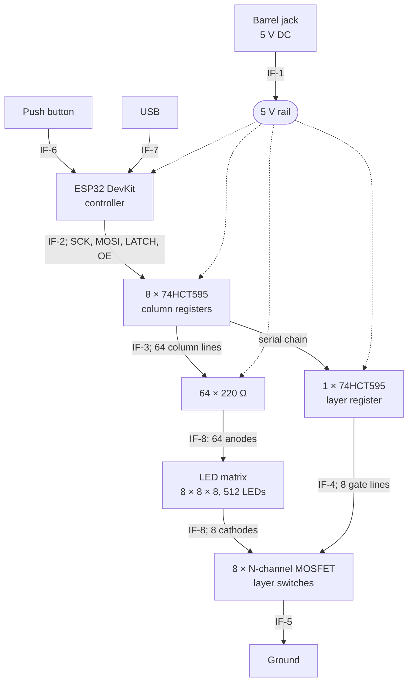

# LED Cube — System Architecture

How the cube is put together, and what crosses each boundary. The numbers it has to meet are in `system-specifications.md`.

## Block diagram

Dotted lines are power; solid lines are signal or LED current.

## How it works

One layer is lit at a time. For each layer the controller blanks the outputs, shifts 72 bits through the register chain, latches them, selects the new layer, and unblanks. Eight of these make one frame, repeated 200 times a second, so every LED is lit for one eighth of the time.

Columns are the anode side: a shift register output goes high and sources current down through a 220 Ω resistor into the column. Layers are the cathode side: an N-channel MOSFET pulls that layer's cathode line to ground. An LED lights only when both its column is driven and its layer is selected. Everything is active high — a `1` lights an LED and a `1` selects a layer.

## Interfaces

### IF-1 — Power input

| Signal | Direction | Level | Notes |
|---|---|---|---|
| V+ | in | 5.0 V ±5 % | Barrel jack centre pin, 5.5 / 2.1 mm |
| GND | — | 0 V | Barrel jack sleeve |

Draws up to 700 mA. The jack feeds the 5 V rail directly; there is no fuse and no reverse-polarity protection.

### IF-2 — Controller to register chain

| Signal | Direction | Level | Notes |
|---|---|---|---|
| SCK | ESP32 → registers | 3.3 V | Shift clock, 4 MHz or faster |
| MOSI | ESP32 → registers | 3.3 V | Serial data into the first register |
| LATCH | ESP32 → registers | 3.3 V | Rising edge moves the shifted bits to the outputs |
| OE | ESP32 → registers | 3.3 V | Active low. Held high to blank the display |

**SPI mode 0, MSB first.** The 595 samples its data input on the rising edge of the shift clock, which is what mode 0 delivers — clock idle low, data changed on the falling edge and sampled on the rising one. Mode 3 also samples on a rising edge and would work; modes 1 and 2 sample on the falling edge and would not. MSB-first ordering is what makes the byte-order rule below hold — LSB-first would mirror each group of eight columns within itself.

**LATCH is a plain GPIO, not the SPI chip-select.** Wiring it to hardware CS works in some drivers, since CS rising at the end of a transfer would latch the data. It is avoided here for two reasons: it depends on the driver holding CS asserted across all nine bytes rather than pulsing it per byte, and blanking needs the latch fired at a chosen moment in the sequence — disable outputs, shift, latch, switch layer, re-enable — rather than as a side effect of the transfer ending.

The registers run from 5 V while the ESP32 drives 3.3 V. HCT parts are used rather than HC because HCT input thresholds accept 3.3 V as a valid high at a 5 V supply; HC does not.

Two of these lines need resistors rather than firmware defaults, because every ESP32 pin is high-impedance until firmware configures it — and at that moment the registers already hold whatever data they powered up with. **OE takes a 10 kΩ pull-up to +3.3 V**, holding the display blank from the instant power arrives. **LATCH takes a 10 kΩ pull-down to ground**, so a floating line cannot clock noise through to the outputs during boot. The OE pull-up goes to 3.3 V and not 5 V because ESP32 pins are not 5 V tolerant; HCT's 2.0 V input threshold means 3.3 V is still a solid high on a 5 V part.

Chain order is MOSI into column register 1, through to column register 8, then into the layer register. Because bits shift along, the first byte sent travels furthest — firmware transmits the layer byte first, then the eight column bytes in reverse order. 72 bits per layer, 576 per frame.

### IF-3 — Column registers to LED anodes

| Signal | Direction | Level | Notes |
|---|---|---|---|
| COL0–COL63 | registers → matrix | 5 V logic, active high | One line per column, each through its own 220 Ω resistor |

Each line sources about 6 mA when high. Up to eight lines per package are active at once, so each register passes about 48 mA — against a 70 mA absolute maximum, which is why the resistor is never reduced.

### IF-4 — Layer register to layer switches

| Signal | Direction | Level | Notes |
|---|---|---|---|
| LAY0–LAY7 | register → MOSFET gates | 5 V logic, active high | High selects that layer |

Exactly one line is high at any moment. Gates are capacitive, so the register sees a brief current spike on each change; this settles well inside the 625 µs a layer lasts.

### IF-5 — Layer switches to ground

| Signal | Direction | Level | Notes |
|---|---|---|---|
| CATH0–CATH7 | matrix → MOSFET drains | up to 384 mA | The whole current of one layer, 64 LEDs at 6 mA |

Only the selected layer's switch conducts. The other seven are open, which is what keeps unselected LEDs dark.

### IF-6 — Button to controller

| Signal | Direction | Level | Notes |
|---|---|---|---|
| BTN | button → ESP32 | 3.3 V, active low | Momentary to ground, internal pull-up enabled |

Debounced in firmware over a 30 ms window. No hardware debounce.

### IF-7 — USB

| Signal | Direction | Level | Notes |
|---|---|---|---|
| USB D+/D− | bidirectional | USB | On the DevKit module, used for flashing firmware |
| Serial | ESP32 → host | USB | Debug output — measured timing and counters |

Reachable without taking the cube apart. Not used in normal operation.

### IF-8 — Matrix to board

| Signal | Direction | Level | Notes |
|---|---|---|---|
| COL0–COL63 | board → matrix | 6 mA per line | Column anodes, an 8 × 8 grid of holes at 900 mil pitch |
| CATH0–CATH7 | matrix → board | up to 384 mA | Layer cathodes, one per layer, brought down to the board |

The lattice terminates in 72 plated through-holes on the controller board and solders directly into them. There is no connector, so the matrix and board are one assembly. The column grid alone occupies 160 × 160 mm, so the board cannot be smaller than the cube's footprint.
