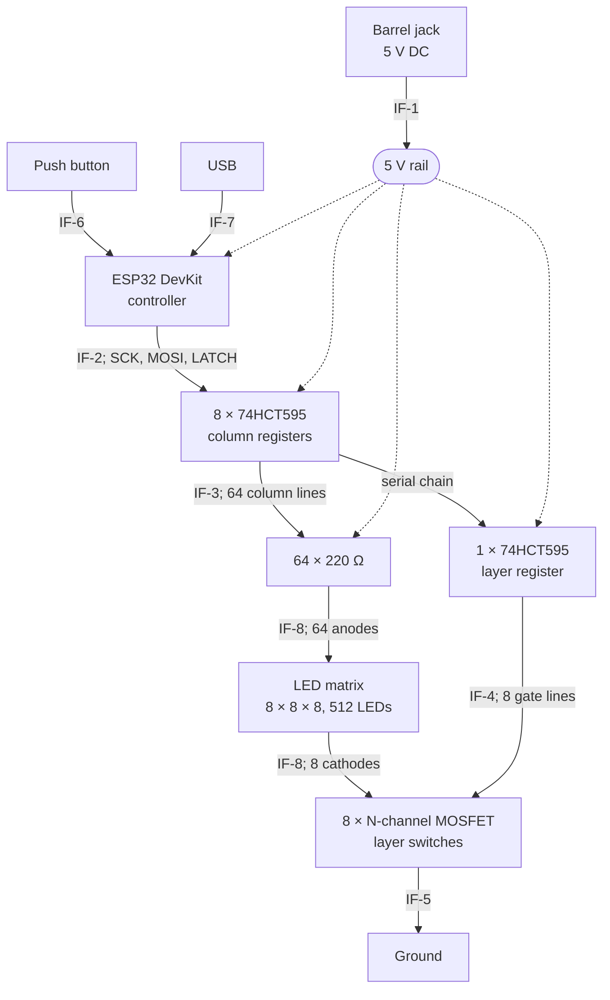

# LED Cube — System Architecture

How the cube is put together, and what crosses each boundary. The numbers it has to meet are in `system-specifications.md`.

## Block diagram



Dotted lines are power; solid lines are signal or LED current.

## How it works

One layer is lit at a time. For each layer the controller shifts 72 bits through the register chain and pulses the latch. That single edge updates the 64 column outputs and the layer select together, so there is no instant where new column data meets the old layer. Eight of these make one frame, repeated 200 times a second, so every LED is lit for one eighth of the time.

Columns are the anode side: a shift register output goes high and sources current down through a 220 Ω resistor into the column. Layers are the cathode side: an N-channel MOSFET pulls that layer's cathode line to ground. An LED lights only when both its column is driven and its layer is selected. Everything is active high — a `1` lights an LED and a `1` selects a layer.

## Interfaces

### IF-1 — Power input

| Signal | Direction | Level | Notes |
|---|---|---|---|
| V+ | in | 5.0 V ±5 % | Barrel jack centre pin, 5.5 / 2.1 mm |
| GND | — | 0 V | Barrel jack sleeve |

Draws up to 700 mA. The jack feeds the 5 V rail directly; there is no fuse and no reverse-polarity protection.

A single **470 µF, 16 V** electrolytic sits across the rail at the jack. It is the only decoupling in the design — there are no 100 nF capacitors at the individual registers. Sized so that the ~400 mA step when a layer switches sags the rail about 50 mV over a 50 µs supply response, well inside the ±5 % in SPEC-18. See RISK-10 for what this omits.

### IF-2 — Controller to register chain

| Signal | Direction | Level | Notes |
|---|---|---|---|
| SCK | ESP32 → registers | 3.3 V | Shift clock, 4 MHz or faster |
| MOSI | ESP32 → registers | 3.3 V | Serial data into the first register |
| LATCH | ESP32 → registers | 3.3 V | Rising edge moves the shifted bits to the outputs |

**SPI mode 0, MSB first.** The 595 samples its data input on the rising edge of the shift clock, which is what mode 0 delivers — clock idle low, data changed on the falling edge and sampled on the rising one. Mode 3 also samples on a rising edge and would work; modes 1 and 2 sample on the falling edge and would not. MSB-first ordering is what makes the byte-order rule below hold — LSB-first would mirror each group of eight columns within itself.

**LATCH is a plain GPIO, not the SPI chip-select.** Wiring it to hardware CS works in some drivers, since CS rising at the end of a transfer would latch the data. It is avoided here because it depends on the driver holding CS asserted across all nine bytes rather than pulsing it per byte — and the latch edge is the moment the whole display updates, so it needs to fire exactly once per layer.

The registers run from 5 V while the ESP32 drives 3.3 V. HCT parts are used rather than HC because HCT input thresholds accept 3.3 V as a valid high at a 5 V supply; HC does not.

**LATCH takes a 10 kΩ pull-down to ground.** Every ESP32 pin is high-impedance until firmware configures it, and a floating latch line can clock noise through to the outputs during boot.

**OE is tied to ground on all nine registers**, so the outputs are permanently enabled and there is no blanking control. The consequence is a brief flash of random data at every power-on, before firmware writes the first frame — the registers come up holding undefined bits and drive them straight to the LEDs. This cannot be fixed in firmware, because firmware is not running yet. See ADR-17.

Chain order is MOSI into column register 1, through to column register 8, then into the layer register. Because bits shift along, the first byte sent travels furthest — firmware transmits the layer byte first, then the eight column bytes in reverse order. 72 bits per layer, 576 per frame.

### IF-3 — Column registers to LED anodes

| Signal | Direction | Level | Notes |
|---|---|---|---|
| COL0–COL63 | registers → matrix | 5 V logic, active high | One line per column, each through its own 220 Ω resistor |

Each line sources about 6.3 mA when high. Up to eight lines per package are active at once, so each register passes about 50 mA — against a 70 mA absolute maximum, which is why the resistor is never reduced.

### IF-4 — Layer register to layer switches

| Signal | Direction | Level | Notes |
|---|---|---|---|
| GATE0–GATE7 | register → MOSFET gates | 5 V logic, active high | High selects that layer. Direct connection, no gate resistor |

Exactly one line is high at any moment.

The switches are **IRLB3813PBF** — N-channel, TO-220, logic level, 3 mΩ at V_GS = 4.5 V, 30 V, threshold 2.35 V maximum. The 4.5 V figure is what matters: the gate is driven from a 5 V shift register output and the rail can sag to 4.75 V, so a part characterised only at 10 V would be barely on.

Gates connect straight to the register outputs, with no series resistor and no pull-down.

**This exceeds the register's per-pin rating during switching.** A gate is a capacitor — 57 nC, about 11 nF equivalent — so at the moment an output goes high the current is limited only by the register's own ~67 Ω output resistance:

```
peak = 5 V / 67 Ω ≈ 75 mA        against a 35 mA per-pin absolute maximum
```

It is brief: the time constant is 0.76 µs, so the overcurrent lasts roughly 2 µs per switch. With 1600 switching events a second, an output is overstressed about 0.4 % of the time. Accepted deliberately — see RISK-09.

A gate pull-down is a smaller loss. Every OE is grounded, so all register outputs are always actively driven and never float, leaving only the moment of power-up uncovered.

### IF-5 — Layer switches to ground

| Signal | Direction | Level | Notes |
|---|---|---|---|
| LAY0–LAY7 | matrix → MOSFET drains | up to 401 mA | The whole current of one layer, 64 LEDs at 6.3 mA |

Only the selected layer's switch conducts. The other seven are open, which is what keeps unselected LEDs dark. At 3 mΩ the conducting switch drops about 1 mV and dissipates half a milliwatt, so no heatsinking is needed despite the TO-220 package.

### IF-6 — Button to controller

| Signal | Direction | Level | Notes |
|---|---|---|---|
| BTN | button → ESP32 | 3.3 V, active low | Momentary to ground, internal pull-up enabled |

Debounced in firmware over a 30 ms window. No hardware debounce.

### IF-7 — USB

| Signal | Direction | Level | Notes |
|---|---|---|---|
| USB D+/D− | bidirectional | USB | On the DevKit module, used for flashing firmware |
| Serial | ESP32 → host | USB | Debug output — measured timing and counters |

Reachable without taking the cube apart. Not used in normal operation.

### IF-8 — Matrix to board

| Signal | Direction | Level | Notes |
|---|---|---|---|
| COL0–COL63 | board → matrix | 6.3 mA per line | Column anodes, an 8 × 8 grid of holes at 900 mil pitch |
| LAY0–LAY7 | matrix → board | up to 401 mA | Layer cathodes, one per layer, brought down to the board |

The lattice terminates in 72 plated through-holes on the controller board and solders directly into them. There is no connector, so the matrix and board are one assembly. The column grid alone occupies 160 × 160 mm, so the board cannot be smaller than the cube's footprint.

---

## Physical construction

Recorded in ADR-19 and ADR-20; repeated here because the interfaces above assume it.

| Property | Value |
|---|---|
| Board outline | 180.3 × 230.5 mm (7100 × 9075 mil) |
| Layers | 2, FR-4, 1.6 mm finished |
| Copper | 1 oz (35 µm) both sides |
| Top layer | Solid +5 pour — the entire 5 V distribution network |
| Bottom layer | Solid GND pour |
| Copper coverage | 90 % top, 94 % bottom |
| Copper to routed edge | 20 mil minimum |
| Vias | 44, 0.30 mm hole / 0.81 mm pad |
| Mounting | 4 × Würth 9771090360R SMD spacers, 9 mm, bottom layer, corners |

The +5 net carries **no tracks and no vias**. Every one of its 21 pads connects through the top polygon alone, which is why the pour's continuity is a functional requirement rather than a convenience. Verified contiguous in `power-integrity.md`.
